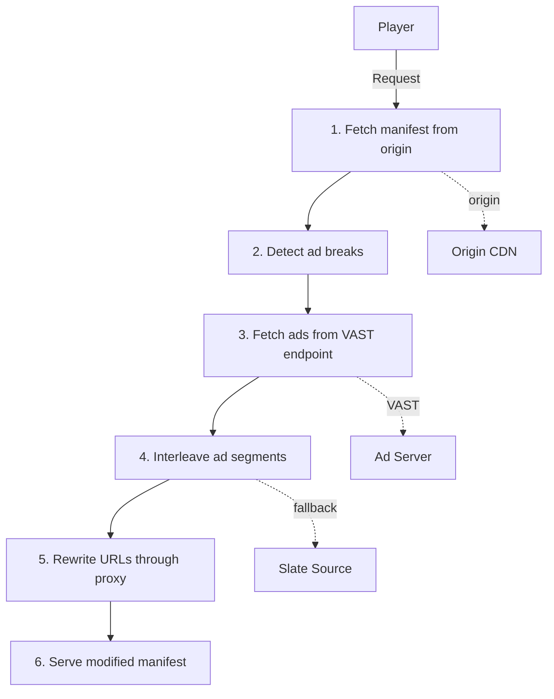

<div align="center">
  

  [](https://github.com/JoeldelPilar/ritcher/actions/workflows/ci.yml)
</div>

## Open-Source Live Ad Insertion Stitcher

Ritcher is a high-performance HLS/DASH stitcher built in Rust for ad insertion. It supports both **SSAI** (Server-Side Ad Insertion) and **SGAI** (Server-Guided Ad Insertion via HLS Interstitials), sitting between the origin CDN and the player to dynamically insert ads into live and VOD streams.

Ritcher runs as a standalone Docker container deployable anywhere. It integrates well with the [Eyevinn Open Source Cloud](https://www.osaas.io) ecosystem — particularly as a downstream stitcher for [Channel Engine](https://github.com/Eyevinn/channel-engine) — but has no platform dependencies.

---

## Features

### HLS
- **SCTE-35 CUE tag detection** — Detects `EXT-X-CUE-OUT`, `EXT-X-CUE-IN`, and `EXT-X-CUE-OUT-CONT` markers in HLS playlists
- **SSAI: Ad interleaving** — Replaces content segments in ad break windows with ad segments, including proper `EXT-X-DISCONTINUITY` tags
- **SGAI: HLS Interstitials** — Injects `EXT-X-DATERANGE` tags with `CLASS="com.apple.hls.interstitial"` per RFC 8216bis, enabling client-side ad playback via hls.js 1.6+ and AVPlayer
- **Asset-list endpoint** — JSON endpoint returning ad creatives per ad break for HLS Interstitials players
- **Master playlist support** — Rewrites variant-stream URLs for multi-quality stitching
- **Demo endpoint** — Synthetic HLS playlist with real Mux test segments, CUE markers, and `EXT-X-PROGRAM-DATE-TIME` for testing

### DASH
- **DASH MPD parsing** — Parse and serialize DASH MPD manifests with hierarchical BaseURL resolution
- **SCTE-35 EventStream detection** — Detects ad breaks from `urn:scte:scte35:2013:xml` EventStream elements
- **URL rewriting** — Rewrites BaseURL and SegmentTemplate URLs at all MPD hierarchy levels through the stitcher proxy
- **Period-based ad insertion** — Inserts ad Periods with SegmentList after detected ad break signals
- **Demo endpoint** — Synthetic DASH manifest with SCTE-35 EventStream for testing

### Shared
- **Multi-track ad insertion** — Handles separate audio/video/subtitle renditions; HLS `track` param for per-rendition playlists, DASH AdaptationSet mirroring with bandwidth and language preservation
- **VAST ad provider** — Fetches and parses VAST 2.0/3.0/4.0 XML from any ad server, with wrapper chain support
- **Static ad provider** — Built-in provider for testing with pre-configured ad segments
- **Slate management** — Fallback filler content when VAST returns no ads or fails
- **Segment proxying** — High-performance proxying for content, ad, and slate segments with retry logic
- **Session management** — In-memory (DashMap) or distributed (Valkey/Redis) session store with automatic TTL-based cleanup. Feature-flagged: `cargo build --features valkey`
- **Prometheus metrics** — `GET /metrics` endpoint with request counts, durations, VAST stats, and session gauges
- **Ad tracking & beaconing** — VAST impression, quartile (start/firstQuartile/midpoint/thirdQuartile/complete), and error beacons fired server-side on segment delivery
- **Ad conditioning** — Warning-level validation of ad creative compatibility (codec, resolution, MIME type)
- **Error recovery** — Retry logic (1 retry, 500ms backoff) for VAST, origin, and ad segment fetches
- **JSON health check** — Structured diagnostics with version, session count, and uptime
- **CORS support** — Permissive in dev mode, restrictive in production
- **Docker ready** — Multi-stage Dockerfile for production deployment

---

## Architecture



---

## Quick Start

### Prerequisites

- Rust stable (edition 2024)

### Development Mode

```bash
# Start with built-in demo and static ad provider
DEV_MODE=true cargo run

# Demo playlist (raw, no stitching):
# http://localhost:3000/demo/playlist.m3u8

# Stitched demo (with ad insertion):
# http://localhost:3000/stitch/demo/playlist.m3u8?origin=http://localhost:3000/demo/playlist.m3u8
```

### With VAST Ad Server

```bash
# Using Eyevinn test-adserver (or any VAST-compatible ad server)
DEV_MODE=true \
VAST_ENDPOINT="http://localhost:8080/api/v1/vast?dur=[DURATION]" \
cargo run
```

### With Slate Fallback

```bash
# VAST mode with slate fallback when ads unavailable
DEV_MODE=true \
VAST_ENDPOINT="http://localhost:8080/api/v1/vast?dur=[DURATION]" \
SLATE_URL="https://hls.src.tedm.io/content/ts_h264_480p_1s" \
cargo run
```

### SGAI Mode (HLS Interstitials)

```bash
# Server-Guided: player fetches ads client-side via HLS Interstitials
DEV_MODE=true \
STITCHING_MODE=sgai \
VAST_ENDPOINT="http://localhost:8080/api/v1/vast?dur=[DURATION]" \
cargo run
```

### Docker

```bash
docker build -t ritcher .

docker run -p 3000:3000 \
  -e PORT=3000 \
  -e BASE_URL=https://stitcher.example.com \
  -e VAST_ENDPOINT=https://ads.example.com/vast \
  ritcher
```

### Production

```bash
PORT=3000 \
BASE_URL=https://stitcher.example.com \
ORIGIN_URL=https://cdn.example.com/stream/playlist.m3u8 \
VAST_ENDPOINT=https://ads.example.com/vast \
SLATE_URL=https://slate.example.com/content \
cargo run --release
```

---

## API Endpoints

| Endpoint | Description |
|----------|-------------|
| `GET /health` | JSON health check (`{ status, version, active_sessions, uptime_seconds }`) |
| `GET /metrics` | Prometheus metrics in text exposition format |
| `GET /demo/playlist.m3u8` | Demo HLS playlist with CUE markers |
| `GET /demo/manifest.mpd` | Demo DASH manifest with SCTE-35 EventStream |
| `GET /stitch/{session_id}/playlist.m3u8?origin={url}` | Stitched HLS playlist with ad insertion |
| `GET /stitch/{session_id}/manifest.mpd?origin={url}` | Stitched DASH manifest with ad insertion |
| `GET /stitch/{session_id}/segment/{*path}?origin={base}` | Proxied content segment (HLS/DASH) |
| `GET /stitch/{session_id}/ad/{ad_name}` | Proxied ad segment |
| `GET /stitch/{session_id}/asset-list/{break_id}?dur={seconds}` | Asset-list JSON for HLS Interstitials (SGAI mode) |

---

## Configuration

| Variable | Description | Required | Default |
|----------|-------------|----------|---------|
| `DEV_MODE` | Enable dev mode with defaults | No | `false` |
| `PORT` | Server port | Prod only | `3000` |
| `BASE_URL` | Stitcher's public URL | Prod only | `http://localhost:3000` |
| `ORIGIN_URL` | Default origin playlist URL | Prod only | — |
| `AD_PROVIDER_TYPE` | `vast`, `static`, or `auto` | No | `auto` |
| `VAST_ENDPOINT` | VAST ad server URL (supports `[DURATION]` and `[CACHEBUSTING]` macros) | For VAST mode | — |
| `SLATE_URL` | Slate fallback content URL | No | — |
| `SLATE_SEGMENT_DURATION` | Slate segment duration (seconds) | No | `1.0` |
| `AD_SOURCE_URL` | Static ad segment source | For static mode | tedm.io test stream |
| `AD_SEGMENT_DURATION` | Static ad segment duration (seconds) | No | `1.0` |
| `SESSION_STORE` | Session backend: `memory` or `valkey` | No | `memory` |
| `VALKEY_URL` | Valkey/Redis connection URL | When `SESSION_STORE=valkey` | — |
| `SESSION_TTL_SECS` | Session TTL in seconds | No | `300` |
| `STITCHING_MODE` | Ad insertion strategy: `ssai` or `sgai` | No | `ssai` |

**Auto-detection**: When `AD_PROVIDER_TYPE=auto` (default), Ritcher uses VAST if `VAST_ENDPOINT` is set, otherwise falls back to static.

**Stitching modes**: `STITCHING_MODE=ssai` (default) replaces content segments with ad segments server-side. `STITCHING_MODE=sgai` injects HLS Interstitial markers (`EXT-X-DATERANGE`) and serves an asset-list endpoint — the player fetches and plays ads client-side. Both modes work with any ad provider (VAST or static).

**Distributed sessions**: To share sessions across multiple Ritcher instances behind a load balancer, build with `cargo build --features valkey` and set `SESSION_STORE=valkey` with a `VALKEY_URL`.

---

## Metrics

Prometheus metrics available at `GET /metrics`:

| Metric | Type | Description |
|--------|------|-------------|
| `ritcher_requests_total` | Counter | Total requests by endpoint and status |
| `ritcher_request_duration_seconds` | Histogram | Request duration by endpoint |
| `ritcher_active_sessions` | Gauge | Currently active sessions |
| `ritcher_ad_breaks_detected` | Counter | Ad breaks detected across all requests |
| `ritcher_vast_requests_total` | Counter | VAST requests by result (success/error/empty) |
| `ritcher_slate_fallbacks_total` | Counter | Slate fallback activations |
| `ritcher_tracking_beacons_total` | Counter | Tracking beacons by event and result |
| `ritcher_origin_fetch_errors_total` | Counter | Origin fetch errors |
| `ritcher_interstitials_injected_total` | Counter | HLS Interstitial DateRange tags injected (SGAI) |
| `ritcher_asset_list_requests_total` | Counter | Asset-list endpoint requests by status (SGAI) |

---

## Performance

In live SSAI, every concurrent viewer gets a **unique manifest** on every segment refresh — this work cannot be CDN-cached. The stitcher's manifest pipeline is one of the scalability bottlenecks.

Ritcher's **CPU-only manifest pipeline** (parse → detect CUE breaks → interleave ads → rewrite URLs → serialize) runs in **~6 µs** for a typical live playlist:

| Scenario | Segments | Ad Breaks | Time per manifest | CPU throughput (single core) |
|---|---|---|---|---|
| Typical live | 6 | 1 | ~6 µs | ~156K ops/sec |
| Medium window | 15 | 1 | ~12 µs | ~84K ops/sec |
| DVR/catchup | 60 | 3 | ~44 µs | ~23K ops/sec |
| Pass-through | 12 | 0 | ~7 µs | ~137K ops/sec |

> **Important:** These numbers measure pure CPU time for manifest manipulation — no network I/O is included. In a real deployment, each manifest request also involves fetching the source playlist from the origin CDN, and segment proxying consumes significant bandwidth. Real-world throughput depends heavily on network latency, connection concurrency, and available bandwidth — not just CPU.

VAST XML parsing adds ~18 µs per ad pod (3 ads, 3 media files each), though in production this is cached per ad break rather than per viewer.

See [BENCHMARK.md](BENCHMARK.md) for detailed results, methodology, scaling estimates, and real-world considerations. Run benchmarks yourself:

```bash
cargo bench
```

---

## Tech Stack

- **Rust** (Edition 2024) — Zero-cost abstractions for manifest-per-viewer scalability
- **Axum 0.8** — Async HTTP server
- **Tokio** — Async runtime
- **m3u8-rs 6.0** — HLS playlist parsing
- **dash-mpd** — DASH MPD parsing and serialization
- **quick-xml** — VAST XML parsing
- **reqwest** — HTTP client with connection pooling
- **DashMap** — Lock-free concurrent in-memory session storage
- **redis 0.29** — Optional Valkey/Redis backend for distributed sessions (feature-flagged)
- **metrics + metrics-exporter-prometheus** — Prometheus observability
- **tower-http** — CORS middleware
- **tracing** — Structured logging

---

## Testing

```bash
# Run all tests (103 tests: 95 unit + 8 E2E)
cargo test

# Run only unit tests
cargo test --lib

# Run only E2E tests
cargo test --test e2e

# Run with logging
RUST_LOG=debug cargo test

# Run benchmarks (Criterion)
cargo bench

# Clippy
cargo clippy -- -D warnings
```

---

## Roadmap

### Phase 1: Production-Ready HLS SSAI

- [x] HLS playlist parsing and URL rewriting
- [x] SCTE-35 CUE-OUT/CUE-IN/CUE-OUT-CONT detection
- [x] Ad interleaving with DISCONTINUITY tags
- [x] Static ad provider (testing)
- [x] VAST ad provider (VAST 2.0/3.0/4.0, wrapper chains)
- [x] Session management with background cleanup
- [x] Demo endpoint with real test segments
- [x] JSON health check with diagnostics
- [x] CORS middleware (dev/prod)
- [x] Slate management (fallback when no ads available)
- [x] Master playlist support
- [x] Prometheus metrics
- [x] Error recovery with retry logic
- [x] Ad conditioning (warning-level creative validation)
- [x] Docker deployment

### Phase 2: DASH Support

- [x] DASH MPD parsing and serialization
- [x] Hierarchical BaseURL resolution (MPD/Period/AdaptationSet/Representation)
- [x] SegmentTemplate URL rewriting through stitcher proxy
- [x] SCTE-35 EventStream ad break detection
- [x] Duration/timing validation with DoS prevention
- [x] Period-based ad insertion (interleaver)
- [x] DASH manifest handler and routes
- [x] DASH demo endpoint

### Phase 3: Multi-Track & Session Hardening

- [x] Multi-track ad insertion (separate audio/video/subtitle renditions)
- [x] Distributed session store (Valkey/Redis for multi-instance consistency)
- [x] Ad tracking and beaconing

### Phase 4a: SGAI — HLS Interstitials

- [x] `STITCHING_MODE` env var (`ssai` default, `sgai` option)
- [x] `EXT-X-DATERANGE` injection with `CLASS="com.apple.hls.interstitial"`
- [x] `EXT-X-PROGRAM-DATE-TIME` synthesis for origins without PDT
- [x] Asset-list JSON endpoint per RFC 8216bis §6.3
- [x] CUE tag removal after DateRange injection (no double-signaling)

### Phase 4b: Advanced

- [ ] Low-latency HLS (LL-HLS)
- [ ] Per-viewer manifest personalization

---

## Why Ritcher?

The SSAI market is growing at 20.3% CAGR toward $14.5B by 2033, yet **no production-ready open-source live SSAI stitcher exists**. Ritcher fills that gap with Rust performance for the CPU-bound work of generating unique manifests per viewer. It works with any VAST-compatible ad server and any HLS/DASH origin — deploy it on [Eyevinn Open Source Cloud](https://www.osaas.io) for a turnkey setup with Channel Engine, or run it standalone anywhere Docker runs.

---

## Author

**Joel del Pilar** ([@JoeldelPilar](https://github.com/JoeldelPilar))

---

## Acknowledgments

Built on the shoulders of [Eyevinn Technology](https://www.eyevinntechnology.se/)'s open-source streaming ecosystem. [Eyevinn Open Source Cloud](https://www.osaas.io) is the recommended deployment platform for a managed experience, but Ritcher runs anywhere.

---

## License

MIT License — see [LICENSE](LICENCE) file for details.
